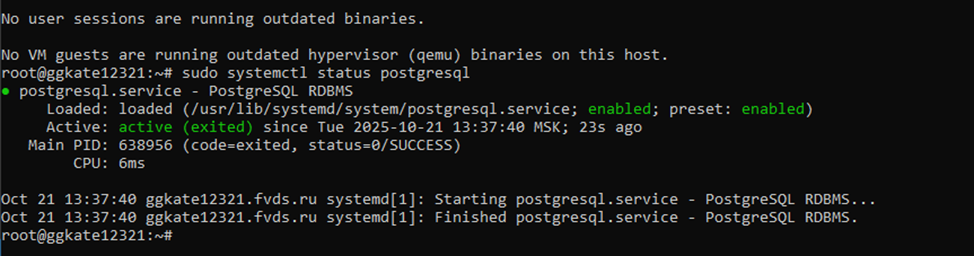

# Практическая работа №5
## Бакланова ЕС
## ЭФМО-01-25

#### Базовая часть
БД создана на виртуальном сервере. Нфстройка удаленного сервера и БД пресдставлена на следующих скриншотах:

1. Подключение к серверу и активация postgre

2. Создание БД todo и вывод тестовой записи

3. Разрешение подключения на порту 5432

4. Разрешение внешних подключений 

5. Тестовое подключение из localhost 

После предварительной настройки сервера был запущен проект, в таблицу todo вставлено несколько тестовых записей.

Проверка:

#### Дополнительно

Дополнительные функции:

1. Функция вывода записей с определенным Done параметром

Для выполнения данной функции сначала был изменен алгоритм создания записей с уазанием Done:

Изменение в создании записей ерез структуру:

Новый create task в Repo:

Сама функция ListDone:

Тестирование:

Результат:

2. Поиск по ID

Сама функция: 

Тестирование:

Результат:

3. Массовая вставка

Сама функция: 

Тестирование:

Результат:

4. 

Текущая настройка:

Новые настройки:
В целом требуется подключения для студента и преподавателя (для проверки). Но стоит создать с запасом 4 одновременных подключения.

Получим:

